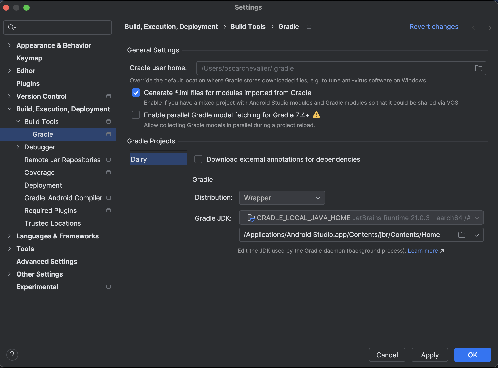

# Downgrading the Gradle JDK on Android Studio Ladybug

From version Ladybug | 2024.2.1 of Android Studio (AS), the software ships with
Java 21 as the Gradle JDK.

Trying to build an SDK project of version `10.1.1` or later without being on
Android Studio Ladybug or later will not work.

This causes build issues for FTC projects on SDK versions before `10.1.1`.

The error looks like this:

Although its tempting to press one of those magical blue links, this is a
horrible idea.

The correct fix here is to downgrade the Gradle JDK version to 17, which is
fairly easy to do.

Select an option for Gradle JDK that is JDK version 17, and rebuild.

If you have no JDK 17 available, then you can click the download JDK option to
install JDK 17.

JDK 17 is a good choice as it will also support the new builds for `10.1.1`
onwards.

