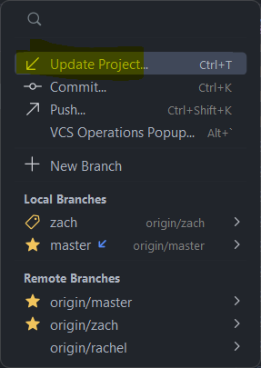
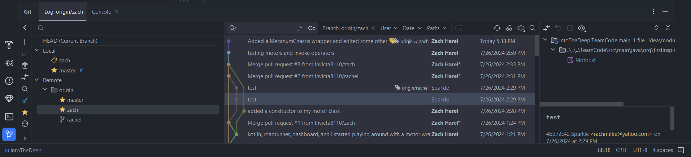
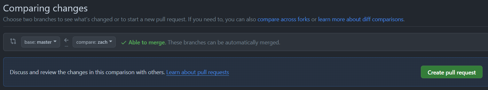

# Introduction to Git and GitHub
This guide is designed to help FTC teams understand how to use Git and GitHub to track changes,
collaborate better, and recover previous versions.
There are often multiple ways to achieve the same task when using Git,
so this guide will explain the method we think is the easiest.

This guide also assumes you are using the base FIRST Tech Challenge SDK.
If you are instead using the RoadRunner quickstart or similar, use that in place of the SDK.

### Git vs GitHub
**Git** is a version control system that tracks changes in code over time, allowing you to collaborate effectively.
**GitHub** is a platform that hosts Git repositories.
Though there are many Git hosting platforms, including GitLab and Bitbucket,
this guide focuses on GitHub because it is the easiest to use with the FTC SDK.

## Ingredients
1. Internet access
2. A computer
3. Android Studio
4. A [GitHub](https://github.com/) account and organization.
    - To create an account, follow the steps on [GitHub](https://docs.github.com/en/get-started/start-your-journey/creating-an-account-on-github).
    - While creating an organization is optional, it is highly recommended for FTC teams.
    Follow the directions on [GitHub](https://docs.github.com/en/organizations/collaborating-with-groups-in-organizations/creating-a-new-organization-from-scratch).
    - Note that user accounts can only create one fork of a repository, while organization accounts can create multiple.
   This makes it easier for your team to set up a repository for each season.

## Recipe
### 0. Installing Git
The easiest way to install Git on your device is
to download it from [Git's download page](https://git-scm.com/downloads).
Select your operating system and follow the instructions on the website.

### 1. Forking the Repository
This step only needs to be done once each season.

> A Fork on GitHub is a copy of another repository on GitHub from one account to another account.
> The new forked repository retains a parent-child relationship with the origin repository.
> Forks are typically used when software will have an independent line of development,
> such as when FTC teams develop their own team code
> using the FIRST-Tech-Challenge/FtcRobotController repository as a basis.
> FTC teams should create a Fork of the FIRST-Tech-Challenge/FtcRobotController repository as a convenient way
> to manage their software development process.
> Thanks to the parent-child relationship,
> when changes are made to the parent repository
> those changes can be easily tracked and fetched/merged into the forked repository,
> keeping the forked repository up to date.
-  The FIRST Tech Challenge documentation

First, open the [FtcRobotController repository](https://github.com/FIRST-Tech-Challenge/FtcRobotController).
The FtcRobotController repo is the Software Development Kit (SDK)
provided by FIRST that allows you to write your own robot code.

Once you have opened the repo, click the `Fork` button in the upper-right-hand corner.
That will bring you to a page that looks like this:

Under the `Owner` dropdown, select your organization (if you elected to create one),
as opposed to your individual user account.
Under `Repository name`, I recommend naming your repo after the current FTC season name
(such as Into The Deep or CenterStage), or by the year (such as 2024).
Finally, press `Create fork` to create your own copy of the SDK repository.

#### 1.5 Logging into GitHub on Android Studio
First, open your [GitHub token settings](https://github.com/settings/tokens),
either by clicking on that link or by going to Account Settings → Developer Settings → Tokens (Classic).
Press `Generate new token (classic)` at the top and that will take you to a page that looks like this:

For `Note`, write the use case of the token, such as "Android Studio."
For `Expiration`, select `No expiration`, which may cause GitHub to warn you.
For `Select scopes`, select `repo`, `workflow`, `read:org`, and `gist`.
Finally, click `Generate token` and copy it.

Now open Android Studio.
Open your settings (under `File` then `Settings`)
and then go to `Version Control` -> `GitHub`.
In the top left corner of the box, press the `+` icon and `Log in with token...`,
and paste in the token you just generated.

### 2. Opening Your Fork in Android Studio
This step needs to be done by everyone who intends on programming for your team.

First, at the top right of your new repository, press the green `Code` button.
Under that tab, copy the HTTP url of your repo.

Next, open Android Studio and navigate to the `New Project from Version Control` menu.
To do that, do `File` -> `New` -> `Project from Version Control`, which should bring you to a menu that looks like this:

For the URL, paste in the link that you just copied from your repo, then press `Clone`.
Android Studio will then download your project and build it through Gradle, which may take a few minutes;
you can monitor this process using the progress bar in the bottom right.

Once this is complete, your project is ready to use,
and you can start coding as normal.

### 3. Your First Commit
Now that you've made some changes,
you should create a *commit* to snapshot your changes and *push* (upload) them to GitHub.
To do this, press the button on the left side that looks like a line with a circle on it
(just like the circles in the above image) to open the Commit menu in Android Studio.
That will look like this:

The `Changes` section will show the files you have edited.
Select the files you want to commit by clicking on the checkbox next to them,
or use the checkbox in the top left to select all of them.

Finally, write a commit message in the box in the lower portion of the menu to describe what you've changed.
In this example, I added a `MecanumChassis` wrapper and edited some other files,
so that's what I wrote in my commit message.

Once you're done,
press `Commit and Push...` which will commit your changes and push them to GitHub's copy of your repository.

In some situations (such as when you are offline, or when a push fails),
you may also prefer to just hit the `Commit` button to save an offline snapshot of your changes,
and then later click your branch title in the top right, which displays the following options:

Click `Push...`, and then `Push` in the bottom right of the menu that comes up after that.

### 4. Pulling from GitHub
Once one person has committed a change,
the other programmers on your team will want to download or *pull* those changes from GitHub.
To do this, click on your branch and then the `Update Project` icon or button in the top left, as shown below:

This will ask you whether you want to Merge or to Rebase the incoming changes.
Merging is simpler, so we will explain it here; select it and hit OK.

Most of the time that will be all that is necessary to download all the incoming changes, and
you will immediately be able to resume coding.
However, occasionally when multiple people edit the same file at the same time, a Merge Conflict can occur.
This can appear as a Conflict pop up as shown below.

See the [official JetBrains documentation](https://www.jetbrains.com/help/idea/resolve-conflicts.html)
for what to do in this scenario.
Make sure to commit after the merge is complete.

## Additional Features

### Updating from the FIRST SDK
Throughout the season, the FIRST SDK sometimes updates to new versions.
To incorporate these changes into your codebase,
we need to add the SDK as a remote repository and then pull in its changes.

First, open a terminal using the button in the bottom left.

Next, the first time you update, run this command in the terminal:
`git remote add sdk https://github.com/FIRST-Tech-Challenge/FtcRobotController/`
This will add the FIRST SDK as a remote repository named `sdk`.
You will only have to do this once.

Next, each time you want to update, run this command: `git pull sdk master --no-rebase`
This will pull the changes from the `master` branch of the `sdk` remote repository.
We use `--no-rebase` here to ensure that we merge instead of rebasing.

Finally, make a new commit to incorporate the changes into your repository.
There will very likely be merge conflicts, review step 4 to learn how to deal with those.

### Creating Branches
A branch allows you to separate your codebase into multiple versions,
which can be developed individually and combined later.
Each branch can have its own set of commits.
In the following image, each circle represents a commit in the branch.

Some teams prefer to create a new branch for each feature that they create.
To do that in AS, in the top menu to go `Git` -> `New Branch`, and type in the name of that feature.
AS will automatically *checkout* that branch, meaning all future commits from your client will be to that branch.

### Merging Branches
To merge changes from one branch onto another through Android Studio, open the Git menu as shown below.

Now, right-click on the branch you intend on merging from and press `Merge origin/<branch> into <branch>`.
This will simply update those files in your local copy of the code with the changes from the other branch.
Note that this can also lead to Merge Conflicts as explained in step 4.
After the merge is complete, make sure to commit the new combined code.

It is also possible to merge changes online through GitHub using Pull Requests.
Pull Requests also allow others to easily review your changes.

At this point, we're going back to the GitHub website.
Open your repository and hit the `Pull Requests` tab in the top left,
which will open a page that looks somewhat like this:

Make sure that both repositories are the same (your repo).
Then, for base, select `master`, and for `compare` select whatever branch you were working with.
Press `Create pull request` and type the name and description of the commit(s) you are working with,
and then press `Create pull request` again.

At this point, GitHub will automatically determine if there are merge conflicts.
See [GitHub's official documentation](https://docs.github.com/en/pull-requests/collaborating-with-pull-requests/addressing-merge-conflicts/resolving-a-merge-conflict-on-github)
for information on how to resolve them, if they occur.
Once any conflicts are resolved,
and you are ready to merge the branches (potentially after getting approval from your team),
select the `Merge pull request` button to accept the pull request.
