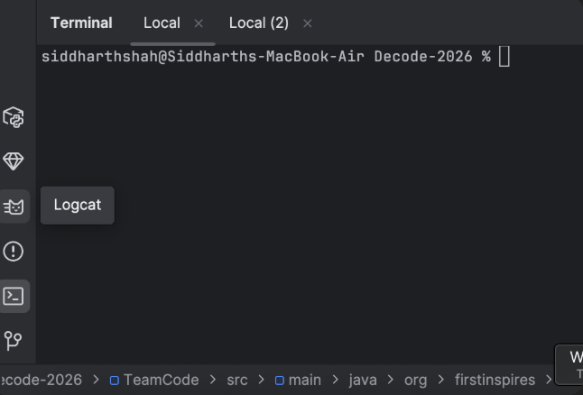
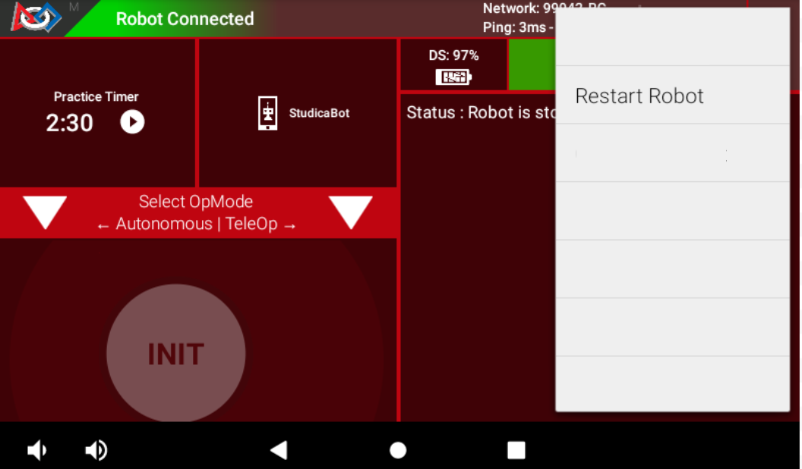

# FTC Robot Logs using Logcat

**[Joe Schmoe | 6767]**: *Nothing works, its all Sloth's fault! @Oscar*\
**[Oscar | !sloth]**:    *Send me a log!*\
**[Oscar | !sloth]**:    *!cb logcat*

## What is Logcat?
Logcat is a utility built into Android Studio, which can be used to view,
analyze, import and export logs from the robot.

FTC software library developers or friendly people helping you to debug your
code will often ask you to send a log in order to determine the issue that you
might be facing, and this page contains the simple instructions to capture and
send a relevant log for them.

## Ingredients
1. Device with Android Studio installed
2. REV Driver Station to run programs

## The Recipe

#### 1. Connect your computer to the robot

#### 2. Click **Logcat** in the bottom left of Android Studio

#### 3. Click **Delete**

#### 4. Restart the robot

#### 5. Reproduce the issue (Run the part that causes the issue)

#### 6. Click **Export** and send the log

#### 7. Send to helper so they can analyze the file

