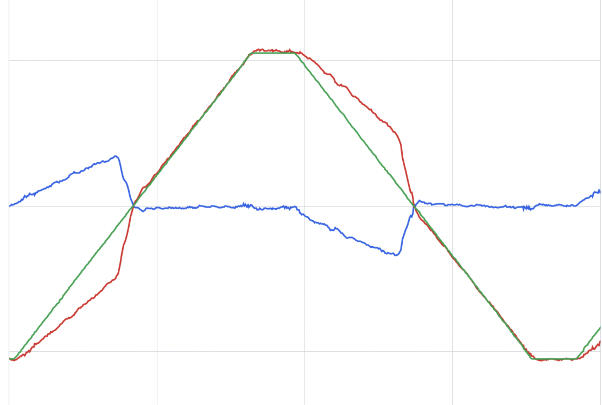

# Is the Bump On Manual Feedforward Tuner Normal?

Yes! 
The bump when accelerating and decelerating is normal. 
It is caused by a fundamental hardware issue with the Control and Expansion Hubs that makes deceleration weird.
There's nothing you can do about it; just try to get the plates and slopes to match up as closely as possible.

*Last Updated: 2024-05-29*