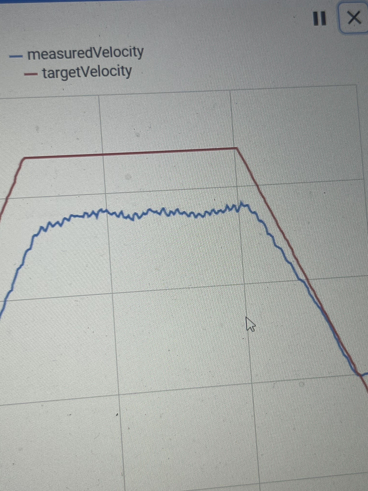

# Robot Velocity Plateaus Below Target Velocity Plateaus

Okay, so this means you've reached your robot's actual max velocity. You should lower the max velocity specified in DriveConstants. Run the MaxVelocityTuner to find the recommended max velocity to use.

*Last Updated: 2024-01-21*